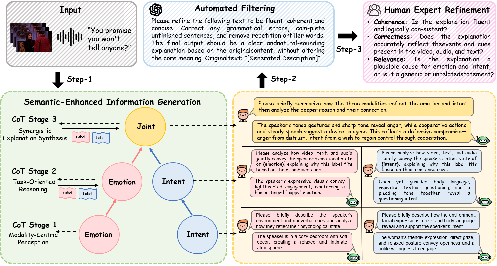
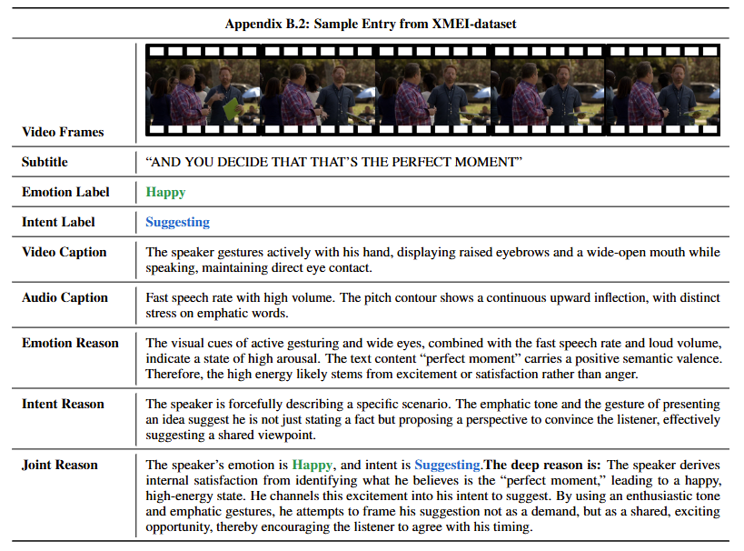
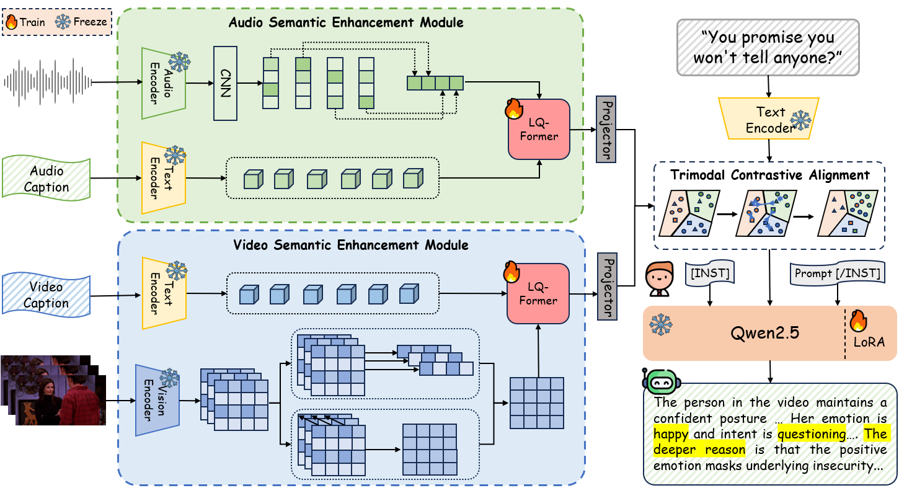
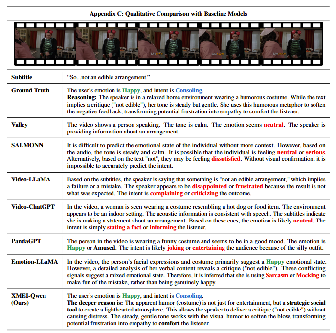
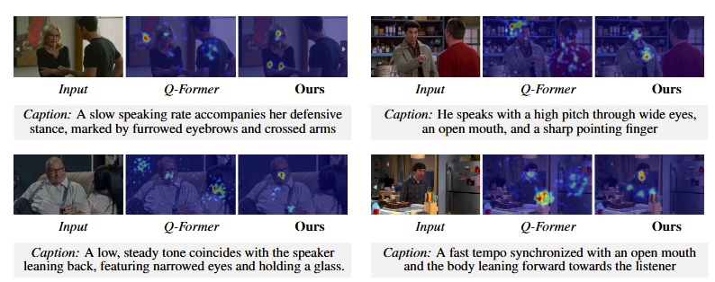

# JX4MEI: Multimodal Semantically-Enhanced LLM for Joint Multimodal Emotion-Intent Explanation and Classification


<a href='#'></a> <a href='#'></a>

***

### ✨ Key Contributions

*   🆕 **New Task: JX4MEI**
    We propose **Joint Multimodal Emotion-Intent Explanation and Classification (JX4MEI)**, a novel task requiring the model to jointly predict emotion and intent while generating natural language explanations for their causal co-occurrence.

*   📚 **New Benchmark: XMEI-dataset**
    We introduce **XMEI-dataset**, the first large-scale benchmark (15,461 samples) featuring fine-grained **Chain-of-Thought (CoT)** annotations that elucidate the causal interplay between emotion and intent.

*   🏗️ **New Architecture: XMEI-Qwen**
    We propose **XMEI-Qwen**, equipped with a novel **Language-Query Former (LQ-Former)**. Unlike standard Q-Formers that rely on blind learnable queries, LQ-Former utilizes modality-specific captions as semantic queries to inject explicit guidance into feature extraction.


***


## 📚 XMEI-dataset

We construct **XMEI-dataset** via a rigorous pipeline involving CoT generation and human-in-the-loop refinement. It contains detailed rationales for emotion, intent, and their synergistic relationship.

<p align="center">
    <a href="#"></a> <br> 
</p>


### Annotation Format
Each entry in `train.json` contains rich annotations, including modality-specific objective descriptions and hierarchical causal reasoning:
```json
{
    "video_id": "",
    "video_path": "",
    "audio_path": "",
    "subtitle": "",
    "emotion": "",
    "intent": "",
    "video_description": "",
    "audio_description": "",
    "emotion_reason": "",
    "intent_reason": "",
    "explanation": ""
}
```

A concrete example is as follows:
<p align="center">
    <a href="#"></a> <br> 
</p>

### 📊 Dataset Comparison

Detailed comparison of our **XMEI-dataset** with existing benchmarks in affective computing. While prior works typically focus on either classification or provide explanations for emotion only, **XMEI-dataset** is the first to provide joint, causal explanations for both emotion and intent in a multimodal setting.

| Datasets | Emotion Label | Intent Label | Modality | Audio Desc. | Visual Desc. | Text Desc. | Emotion Expl. | Intent Expl. | Joint Expl. |
| :--- | :---: | :---: | :---: | :---: | :---: | :---: | :---: | :---: | :---: |
| MIntRec | ❌ | ✅ | T+A+V | ❌ | ❌ | ❌ | ❌ | ❌ | ❌ |
| Behance-Int | ❌ | ✅ | T+A+V | ❌ | ❌ | ❌ | ❌ | ❌ | ❌ |
| DailyDialog | ✅ | ❌ | T | ❌ | ❌ | ❌ | ❌ | ❌ | ❌ |
| IEMOCAP | ✅ | ❌ | T+A+V | ❌ | ❌ | ❌ | ❌ | ❌ | ❌ |
| MELD | ✅ | ❌ | T+A+V | ❌ | ❌ | ❌ | ❌ | ❌ | ❌ |
| M3ED | ✅ | ❌ | T+A+V | ❌ | ❌ | ❌ | ❌ | ❌ | ❌ |
| Twitter | ✅ | ✅ | T | ❌ | ❌ | ❌ | ❌ | ❌ | ❌ |
| ED | ✅ | ✅ | T | ❌ | ❌ | ❌ | ❌ | ❌ | ❌ |
| OSED | ✅ | ✅ | T | ❌ | ❌ | ❌ | ❌ | ❌ | ❌ |
| EmoInt-MD | ✅ | ✅ | T+A+V | ❌ | ❌ | ❌ | ❌ | ❌ | ❌ |
| MC-EIU | ✅ | ✅ | T+A+V | ❌ | ❌ | ❌ | ❌ | ❌ | ❌ |
| ECEM | ✅ | ❌ | T+V | ❌ | ✅ | ❌ | ✅ | ❌ | ❌ |
| EMER | ✅ | ❌ | T+A+V | ✅ | ✅ | ✅ | ❌ | ❌ | ❌ |
| MERR | ✅ | ❌ | T+A+V | ✅ | ✅ | ✅ | ✅ | ❌ | ❌ |
| MER-Caption | ✅ | ❌ | T+A+V | ✅ | ✅ | ✅ | ✅ | ❌ | ❌ |
| **XMEI-dataset (Ours)** | ✅ | ✅ | **T+A+V** | ✅ | ✅ | ✅ | ✅ | ✅ | ✅

***

## 🚀 XMEI-Qwen

<div align="center">
  
  
</div>


### 🏗️ Architecture Overview
The overall framework consists of three key components:
1.  **Multimodal Encoders:** Frozen **CLIP ViT-L/14** for visual features and **HUBERT-Large** for acoustic features.
2.  **Modality Interface (LQ-Former):** A semantic-enhanced connection module that aligns dense multimodal features with the LLM's embedding space using caption-guided attention.
3.  **LLM Backbone:** **Qwen2.5-7B-Instruct**, fine-tuned via **LoRA** to jointly predict labels and synthesize synergistic explanations.

### 🏆 Main Results

Main results on the **XMEI-dataset** test set for explanation generation. We compare our model, **XMEI-Qwen**, against various state-of-the-art multimodal models. 

Main results on the **XMEI-dataset** test set for explanation generation. We compare our model, **XMEI-Qwen**, against various state-of-the-art multimodal models. 

| Method | A | V | T | BLEU-4 | ROUGE-L | METEOR | BERTScore | BLEURT | CIDEr |
| :--- | :---: | :---: | :---: | :---: | :---: | :---: | :---: | :---: | :---: |
| SALMONN | ✅ | ❌ | ✅ | 0.1513 | 0.4639 | 0.4730 | 0.7935 | -0.5011 | 0.4786 |
| PandaGPT | ✅ | ❌ | ✅ | 0.1363 | 0.4211 | 0.4187 | 0.7132 | -0.7031 | 0.4079 |
| Qwen-Audio | ✅ | ❌ | ✅ | <u>0.1637</u> | <u>0.4817</u> | <u>0.4791</u> | <u>0.8002</u> | <u>-0.4796</u> | <u>0.4903</u> |
| **Our (A+T)** | ✅ | ❌ | ✅ | **0.1712** | **0.4853** | **0.4886** | **0.8156** | **-0.4689** | **0.5021** |
| Valley | ❌ | ✅ | ✅ | 0.1437 | 0.4376 | 0.4179 | 0.7010 | <u>-0.4072</u> | 0.4809 |
| VideoChat | ❌ | ✅ | ✅ | 0.1501 | 0.4408 | 0.4570 | 0.7137 | -0.4339 | 0.4903 |
| Video-LLaMA | ❌ | ✅ | ✅ | 0.1279 | 0.4096 | 0.3901 | 0.7033 | -0.6837 | 0.4479 |
| Video-LLaMA2 | ❌ | ✅ | ✅ | 0.1479 | <u>0.4659</u> | 0.4083 | <u>0.8061</u> | -0.4430 | <u>0.5139</u> |
| Video-LLaVA | ❌ | ✅ | ✅ | 0.1408 | 0.4237 | 0.3971 | 0.7713 | -0.4370 | 0.4671 |
| Video-ChatGPT | ❌ | ✅ | ✅ | 0.1503 | 0.4479 | <u>0.4728</u> | 0.7830 | -0.5029 | 0.4660 |
| MiniGPT-4 | ❌ | ✅ | ✅ | 0.1370 | 0.4090 | 0.4276 | 0.7513 | -0.5371 | 0.4091 |
| MiniGPT-v2 | ❌ | ✅ | ✅ | <u>0.1535</u> | 0.4516 | 0.4159 | 0.7835 | -0.5832 | 0.4766 |
| **Our (V+T)** | ❌ | ✅ | ✅ | **0.1624** | **0.4831** | **0.4782** | **0.8115** | **-0.4065** | **0.5284** |
| PandaGPT | ✅ | ✅ | ✅ | 0.1505 | 0.4672 | 0.4711 | 0.7912 | -0.5133 | 0.4755 |
| Emotion-LLaMA | ✅ | ✅ | ✅ | 0.1970 | 0.5024 | 0.5031 | 0.8278 | -0.4098 | 0.5366 |
| AffectGPT | ✅ | ✅ | ✅ | <u>0.2158</u> | <u>0.5193</u> | <u>0.5142</u> | <u>0.8366</u> | <u>-0.3852</u> | <u>0.6021</u> |
| **XMEI-Qwen (Ours)** | ✅ | ✅ | ✅ | **0.2415** | **0.5528** | **0.5386** | **0.8692** | **-0.3541** | **0.6284** |
***

## 🛠️ Installation

Creating conda environment

```bash
conda create -n jx4mei python=3.10
conda activate jx4mei
```

**Dependencies** :

*   python == 3.10
*   pytorch == 2.4.0
*   CUDA Version == 12.1
*   transformers == 4.49.0
*   tokenizers == 0.21.0
*   peft == 0.11.1
*   accelerate == 0.31.0
*   decord == 0.6.0
*   librosa == 0.10.2

**📥 General Checkpoints**

Please download the following pre-trained models to initialize the encoders and the LLM backbone.

| Model Name | Model Type | Source |
| :--- | :---: | :---: |
| [clip-vit-large-patch14](https://huggingface.co/openai/clip-vit-large-patch14) | Visual Encoder | [HuggingFace](https://huggingface.co/openai/clip-vit-large-patch14) |
| [hubert-large-ls960-ft](https://huggingface.co/facebook/hubert-large-ls960-ft) | Audio Encoder | [HuggingFace](https://huggingface.co/facebook/hubert-large-ls960-ft) |
| [Qwen2.5-7B-Instruct](https://huggingface.co/Qwen/Qwen2.5-7B-Instruct) | LLM | [HuggingFace](https://huggingface.co/Qwen/Qwen2.5-7B-Instruct) |
***


## 🔥 Training

Before starting the training, please ensure that you have prepared the dataset and configured the parameters correctly.

### 1. Data Preparation
Please organize the **XMEI-dataset** as follows so the dataloader can locate the files correctly:

```text
data/
├── xmei_dataset/
│   ├── videos/             # Raw video files
│   ├── audios/             # Extracted audio files
│   └── annotations/        # JSON/JSONL annotation files
│       ├── train.json
│       └── val.json
└── ...
```
> 📝 **Note:** You can modify the data paths in `train/xmei_qwen_train.yaml`.

### 2. Training Command

You can launch the training using the following command. The script supports multi-GPU training via `DataParallel` or `DistributedDataParallel` (depending on your implementation).

**Multi-GPU Training (Recommended):**
```bash
# Example: Using 4 GPUs (IDs: 0, 1, 2, 3)
CUDA_VISIBLE_DEVICES=0,1,2,3 python train.py \
    --cfg-path train/xmei_qwen_train.yaml \
    --output_dir ./checkpoints/xmei_qwen_v1
```

**Single-GPU Debugging:**
If you want to debug or run on a single GPU:
```bash
CUDA_VISIBLE_DEVICES=0 python train.py \
    --cfg-path train/xmei_qwen_train.yaml
```

### 3. Configuration (`.yaml`)
Key hyperparameters can be adjusted in `configs/train_/xmei_qwen_train.yaml`. Below is an example of the configuration structure:

```yaml
model:
  arch: xmeiqwen
  model_type: pretrain_vicuna
  ckpt: ""
  # Encoders
  llama_model: "Qwen25"            
  acoustic_encoder: "HUBERT_LARGE" 
  visual_encoder: "CLIP_VIT_LARGE" 
  
  # LQ-Former Settings (Semantic Queries)
  num_audio_query_token: 32 
  num_video_query_token: 32
  
  # LoRA Settings
  lora_r: 64
  frozen_llm: False # Set to False to enable LoRA training

datasets:
  mercaptionplus:
    data_type: video
    face_or_frame: 'multiframe' # Use 'multiframe' for full-frame video input

run:
  task: image_text_pretrain
  
  # Optimization
  lr_sched: "linear_warmup_cosine_lr"
  init_lr: 1e-5 
  min_lr: 1e-5
  warmup_lr: 1e-6
  weight_decay: 0.05
  warmup_steps: 5000   
  
  # Training Loop
  max_epoch: 60 
  batch_size_train: 16 # Adjust based on your GPU VRAM
  batch_size_eval:  16 
  
  # System
  num_workers: 4
  seed: 42
  amp: True
```

### 4. Logging & Monitoring
*   **Logs:** Training logs (loss, accuracy, etc.) will be saved in the `output_dir/logs` directory.
*   **WandB (Optional):** If you enabled WandB in the config, you can monitor the training progress online:
    ```bash
    wandb login
    # Ensure use_wandb: True in your yaml config
    ```

### 5. Troubleshooting
*   **OOM (Out of Memory):** Since Qwen2.5-7B is a large model, if you encounter OOM errors:
    1.  Decrease `batch_size` in the yaml file.
    2.  Increase `gradient_accumulation_steps` to maintain the effective batch size.
    3.  Ensure `use_lora` is set to `True`.
    4.  Enable `gradient_checkpointing` in the config.

***


## 🎬 Demo

We present a qualitative comparison on a challenging sample requiring the understanding of **irony** and **complex social intent**. In this scenario, the text implies a critique ("*not an edible arrangement*"), but the visual context (humorous costume) and acoustic tone create a supportive atmosphere.
<p align="center">
    <a href="#"></a> <br> 
</p>

**Analysis:**
*   **Baselines Struggle:** Existing models fail to integrate these conflicting cues. For instance, **Video-LLaMA** relies too heavily on the negative text, predicting "*Complaining*". **Emotion-LLaMA** misinterprets the conflict as "*Mocking*" or "*Sarcasm*". **PandaGPT** captures the surface-level humor ("*Joking*") but misses the deeper social purpose.
*   **XMEI-Qwen Succeeds:** Our model correctly identifies the emotion as **Happy** and the intent as **Consoling**. Crucially, it provides a logical explanation: identifying that the humor is used as a *"strategic social tool"* to soften the criticism and comfort the listener. This demonstrates the effectiveness of our **LQ-Former** in grounding semantic reasoning.

## 👁️ Visualization: Why LQ-Former?

To demonstrate the effectiveness of our **Semantic-Enhanced** approach, we visualize the cross-attention maps of the Standard Q-Former versus our **LQ-Former**.

<div align="center">
  
</div>
<br>

**Key Observations:**
*   **Standard Q-Former (Baseline):** Suffers from **Salient Object Bias**. It often gets distracted by background clutter (e.g., the colorful kitchenware in the bottom-right case) rather than the speaker.
*   **LQ-Former (Ours):** Achieves robust **Semantic Grounding**. Guided by modality-specific captions (e.g., *"furrowed eyebrows"*, *"pointing finger"*), it precisely focuses on task-relevant regions like facial expressions and body language, effectively filtering out noise.

